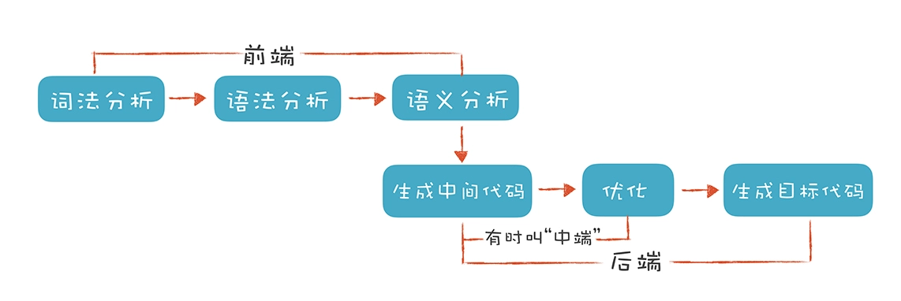

编译原理之美-宫文学-学习摘要
[TOC]
# 实现一门脚本语言.原理篇
## 理解代码:编译器的前端技术

这里的“前端”指的是编译器对程序代码的分析和理解过程。
“后端”则是生成目标代码，跟目标机器有关。

### 词法分析（Lexical Analysis）
>词法分析是把程序分割成一个个Token的过程，可以通过构造有限自动机来实现。

辅助工具:Lex

### 语法分析
>语法分析是把程序的结构识别出来，并形成一棵便于由计算机处理的抽象语法树。可以用递归下降的算法来实现。

mac上使用下面的命令可以体验下ast树

`clang -cc1 -ast-dump hello.c`

[js ast体验](https://resources.jointjs.com/demos/javascript-ast)

辅助工具：Yacc、Antlr、JavaCC等。更多列表[参考](https://blog.csdn.net/gongwx/article/details/99645305)

[golang ast](https://zupzup.org/go-ast-traversal/)

### 语义分析
>语义分析是消除语义模糊，生成一些属性信息，让计算机能够依据这些信息生成目标代码。

## 正则文法和有限自动机：纯手工打造词法分析器


示例程序分析以下语句
```
age >= 45
int age = 40
2 + 3*5
intA = 10
```

作者的[实现代码](https://github.com/RichardGong/PlayWithCompiler/blob/master/lab/craft/SimpleLexer.java)

>要实现一个词法分析器，首先需要写出每个词法的正则表达式，并画出有限自动机，之后，只要用代码表示这种状态迁移过程就可以了。

golang可以参考json的实现方式。

## 语法分析（一）：纯手工打造公式计算器
主要是 语法分析的原理和递归下降算法，上下文无关文法。
本课稍有单独，需要看原文。
[作者源码](https://github.com/RichardGong/PlayWithCompiler/blob/master/lab/craft/SimpleCalculator.java)
自己手动实现一遍有助于理解。


## 语法分析（二）：解决二元表达式中的难点
巴科斯范式 BNF
```
add ::= mul | add + mul
```

扩展巴科斯范式 EBNF
```
add -> mul ( + mul ) *
```

一个规律：
>对于左结合的运算符，递归项要放在左边；而右结合的运算符，递归项放在右边。

但是左递归有个无限循环的问题。

解决办法是修改文法：
```
add -> mul add'
add' -> + mul add' | ε
```
可以用EBNF表达为
```
add -> mul ( + mul ) *
```

## 语法分析(三)：实现一门简单的脚本语言
就是进一步扩展代码

## 编译器前端工具（二）：用Antlr生成词法、语法分析器

[antlr官网](https://www.antlr.org/)
mac 可以直接用homebrew 安装。
[antlr语法参考](https://github.com/antlr/grammars-v4)

### 词法分析
antlr规则文件以`.g4`结尾。
示例 Hello.g4
```
lexer grammar Hello;  //lexer 关键字意味着这是一个词法规则文件，名称是 Hello，要与文件名相同

// 关键字
If :               'if';
Int :              'int';

// 字面量
IntLiteral:        [0-9]+;
StringLiteral:      '"' .*? '"' ;  // 字符串字面量

// 操作符
AssignmentOP:       '=' ;
RelationalOP:       '>'|'>='|'<' |'<=' ;
Star:               '*';
Plus:               '+';
Sharp:              '#';
SemiColon:          ';';
Dot:                '.';
Comm:               ',';
LeftBracket :       '[';
RightBracket:       ']';
LeftBrace:          '{';
RightBrace:         '}';
LeftParen:          '(';
RightParen:         ')';

// 标识符
Id :                [a-zA-Z_] ([a-zA-Z_] | [0-9])*;

// 空白字符，抛弃
Whitespace:         [ \t]+ -> skip;
Newline:            ( '\r' '\n'?|'\n')-> skip;
```


生成golang的需要[参考](https://github.com/antlr/antlr4/blob/master/doc/go-target.md)
`go get github.com/antlr/antlr4/runtime/Go/antlr`

**编译词法规则**
```
antlr -Dlanguage=Go Hello.g4
```

生成了3个文件`Hello.interp`   `Hello.tokens`  `hello_lexer.go`

手写一个grun.go
```
package main

import (
	parser "GoPlayWithCompiler/antlrdemo"
	"fmt"
	"github.com/antlr/antlr4/runtime/Go/antlr"
	"os"
)


func main() {
	input, _ := antlr.NewFileStream(os.Args[1])
	lexer := parser.NewHello(input)
	stream := antlr.NewCommonTokenStream(lexer, 0)
	stream.Fill()
	for _, token := range stream.GetAllTokens() {
		fmt.Println(token)
	}

}

```

执行以下命令获取token:
`go run cmds/hello/main.go antlrdemo/Hello/hello.play`

生成如下文本：
```
[@0,0:2='int',<2>,1:0]
[@1,4:6='age',<19>,1:4]
[@2,8:8='=',<5>,1:8]
[@3,10:11='45',<3>,1:10]
[@4,12:12=';',<10>,1:12]
[@5,14:15='if',<1>,2:0]
[@6,17:17='(',<17>,2:3]
[@7,18:20='age',<19>,2:4]
[@8,22:23='>=',<6>,2:8]
[@9,25:26='17',<3>,2:11]
[@10,27:27='+',<8>,2:13]
[@11,28:28='8',<3>,2:14]
[@12,29:29='+',<8>,2:15]
[@13,30:31='20',<3>,2:16]
[@14,32:32=')',<18>,2:18]
[@15,33:33='{',<15>,2:19]
[@16,37:42='printf',<19>,3:2]
[@17,43:43='(',<17>,3:8]
[@18,44:59='"Hello old man!"',<4>,3:9]
[@19,60:60=')',<18>,3:25]
[@20,61:61=';',<10>,3:26]
[@21,63:63='}',<16>,4:0]
[@22,64:63='<EOF>',<-1>,4:1]
```

### 语法分析

`PlayScript.g4`
```
grammar PlayScript;
import CommonLexer;   // 导入词法定义

/* 下面的内容加到所生成的 Java 源文件的头部，如包名称，import 语句等。*/
@header {
package antlrtest;
}
expression
    :   assignmentExpression
    |   expression ',' assignmentExpression
    ;

assignmentExpression
    :   additiveExpression
    |   Identifier assignmentOperator additiveExpression
    ;

assignmentOperator
    :   '='
    |   '*='
    |  '/='
    |   '%='
    |   '+='
    |   '-='
    ;

additiveExpression
    :   multiplicativeExpression
    |   additiveExpression '+' multiplicativeExpression
    |   additiveExpression '-' multiplicativeExpression
    ;

multiplicativeExpression
    :   primaryExpression
    |   multiplicativeExpression '*' primaryExpression
    |   multiplicativeExpression '/' primaryExpression
    |   multiplicativeExpression '%' primaryExpression
    ;
```


生成目标文件`antlr -Dlanguage=Go PlayScript.g4`
手写个交互式脚本来解析语法，并画出ast树。具体[参考](https://github.com/bjmayor/GoPlayWithCompiler/blob/master/cmds/playScript/main.go)

[json](https://github.com/antlr/grammars-v4/blob/master/json/JSON.g4)的这个语法很简单，适合学习。
