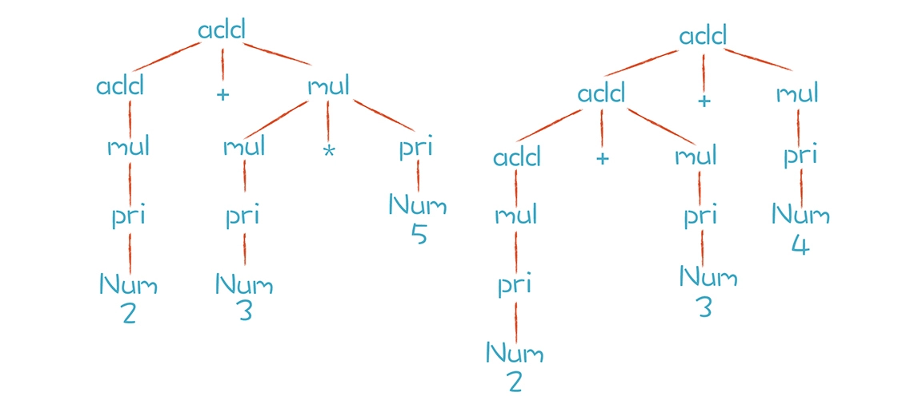
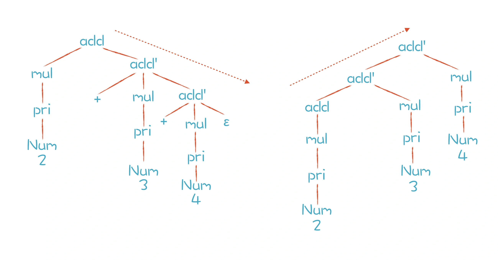

 概念回顾：
在二元表达式的语法规则中，如果产生式的第一个元素是它自身，那么程序就会无限地递归下去，这种情况就叫做左递归。
而优先级和结合性则是计算机语言中与表达式有关的核心概念。

# 书写语法规则，并进行推导

我们已经知道，语法规则是由上下文无关文法表示的，而上下文无关文法是由一组替换规则（又叫产生式）组成的，比如算术表达式的文法规则可以表达成下面这种形式：

```
add -> mul | add + mul
mul -> pri | mul * pri
pri -> Id | Num | (add)
```

按照上面的产生式，add 可以替换成 mul，或者 add + mul。这样的替换过程又叫做“推导”。以“2+3*5” 和 “2+3+4”这两个算术表达式为例，这两个算术表达式的推导过程分别如下图所示：


上图中两颗树的叶子节点有哪些呢？Num、+ 和 * 都是终结符，终结符都是词法分析中产生的 Token。而那些非叶子节点，就是非终结符。文法的推导过程，就是把非终结符不断替换的过程，让最后的结果没有非终结符，只有终结符。

而在实际应用中，语法规则经常写成下面这种形式：

```
add ::= mul | add + mul
mul ::= pri | mul * pri
pri ::= Id | Num | (add)
```
这种写法叫做“**巴科斯范式**”，简称 BNF。Antlr 和 Yacc 这两个工具都用这种写法

你有时还会听到一个术语，叫做**扩展巴科斯范式 (EBNF)**。它跟普通的 BNF 表达式最大的区别，就是里面会用到类似正则表达式的一些写法。比如下面这个规则中运用了 * 号，来表示这个部分可以重复 0 到多次：

```
add -> mul (+ mul)*
```
其实这种写法跟标准的 BNF 写法是等价的，但是更简洁。为什么是等价的呢？因为一个项多次重复，就等价于通过递归来推导。从这里我们还可以得到一个推论：就是上下文无关文法包含了正则文法，比正则文法能做更多的事情。

# 确保正确的优先级
我们由加法规则推导到乘法规则，这种方式保证了 AST 中的乘法节点一定会在加法节点的下层，也就保证了乘法计算优先于加法计算。

**越底层，优先级越高**

听到这儿，你一定会想到，我们应该把关系运算（>、=、<）放在加法的上层，逻辑运算（and、or）放在关系运算的上层。的确如此，我们试着将它写出来：

```
exp -> or | or = exp
or -> and | or || and
and -> equal | and && equal
equal -> rel | equal == rel | equal != rel
rel -> add | rel > add | rel < add | rel >= add | rel <= add
add -> mul | add + mul | add - mul
mul -> pri | mul * pri | mul / pri
```

这里表达的优先级从低到高是：赋值运算、逻辑运算（or）、逻辑运算（and）、相等比较（equal）、大小比较（rel）、加法运算（add）、乘法运算（mul）和基础表达式（pri）。

其实，我们在最低层，也就是优先级最高的基础表达式（pri）这里，用括号把表达式包裹起来，递归地引用表达式就可以了。这样的话，只要在解析表达式的时候遇到括号，那么就知道这个是最优先的。这样的话就实现了优先级的改变：

```
pri -> Id | Literal | (exp)
```

## 确保正确的结合性
> 什么是结合性呢？同样优先级的运算符是从左到右计算还是从右到左计算叫做结合性。我们常见的加减乘除等算术运算是左结合的，“.”符号也是左结合的。

**对于左结合的运算符，递归项要放在左边；而右结合的运算符，递归项放在右边。**

所以你能看到，我们在写加法表达式的规则的时候，是这样写的：

```
add -> mul | add + mul
```

## 消除左递归

消除左递归，用一个标准的方法，就能够把左递归文法改写成非左递归的文法。以加法表达式规则为例，原来的文法是“add -> add + mul”，现在我们改写成：

```
add -> mul add'
add' -> + mul add' | ε
```

文法中，ε（读作 epsilon）是空集的意思。接下来，我们用刚刚改写的规则再次推导一下 “2+3+4”这个表达式，得到了下图中左边的结果：


左边的分析树是推导后的结果。问题是，由于 add’的规则是右递归的，如果用标准的递归下降算法，我们会跟上一讲一样，又会出现运算符结合性的错误。我们期待的 AST 是右边的那棵，它的结合性才是正确的。那么有没有解决办法呢？

答案是有的。我们仔细分析一下上面语法规则的推导过程。只有第一步是按照 add 规则推导，之后都是按照 add’规则推导，一直到结束。

如果用 #EBNF 方式表达，也就是允许用 * 号和 + 号表示重复，上面两条规则可以合并成一条：
```
add -> mul (+ mul)*
```

写成这样有什么好处呢？能够优化我们写算法的思路。对于 (+ mul)* 这部分，我们其实可以写成一个循环，而不是一次次的递归调用。
伪代码如下：

```
mul();
while(next token is +){
  mul()
  createAddNode
}
```
